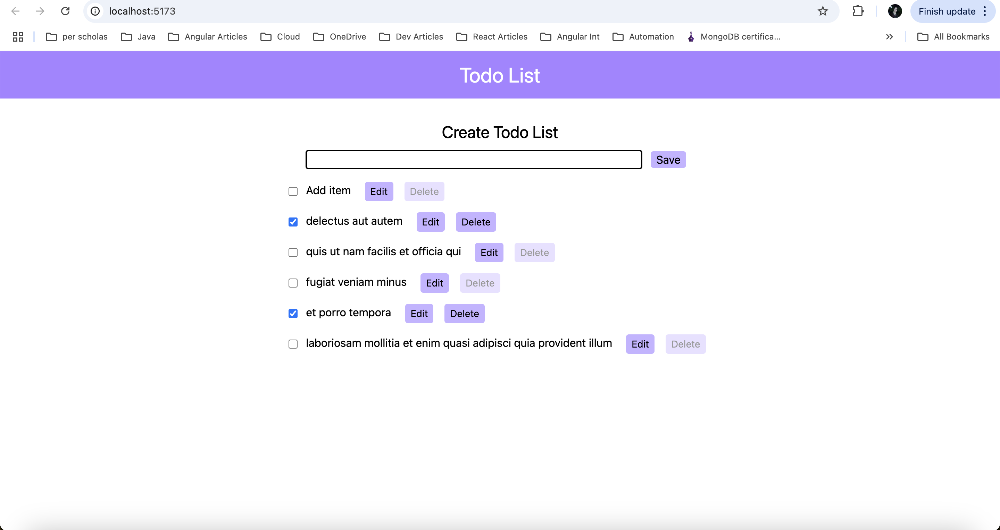

# React + Vite

# OBJECTIVE

A to-do list application can be built using React, managing tasks through state and reducer hooks and rendering them dynamically.Lets users add new tasks and delete existing tasks, edit tasks, checking and unchecking items to mark them as complete or incomplete.

## Technologies Used

- HTML
- CSS (used tailwind css)
- React

## Todo List Applications must have

- A heading labeling it as a "todo list."
- A list of "todo" items, which are strings listing activities to be accomplished (e.g. "find that missing sock"). Each "todo" item should have:

- A checkbox next to it which indicates whether it is "complete."
- A "delete" button next to it which removes it from the list.

- The "delete" button should be disabled unless the todo is complete!
- An "edit" button that replaces the todo string with a text input used to edit the todo.
- When this text input is active, the "delete" and "edit" buttons should be hidden, and a "save" button should appear. The "save" button should save any changes made to the todo within the text input.
- An input element that creates new todo items and adds them to the list.
- New todos should be added to the top of the list visually; the oldest todos should be at the bottom.

## Output

